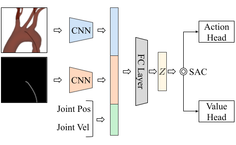
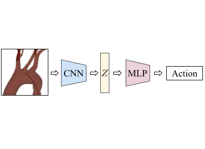

# CathSim: An Open-source Simulator for Endovascular Intervention
### [[Project Page](https://robotvisionlabs.github.io/cathsim/)] [[Paper](https://arxiv.org/abs/2208.01455)]


<div align="center">
    <a href="https://"></a>
</div>


## Contents
1. [Requirements](#requirements)
2. [Installation](#installation)
3. [Quickstart](#quickstart)
4. [Training](#training)
5. [Manual Control](#manual-control)
6. [Mesh Processing](#mesh-processing)


## Requirements
1. Ubuntu (tested with Ubuntu 22.04 LTS)
2. Miniconda (tested with 23.5 but all versions should work)
3. Python 3.9

If `miniconda` is not installed run the following for a quick Installation. Note: the script assumes you use `bash`.

```bash
# installing miniconda
mkdir -p ~/.miniconda3
wget https://repo.anaconda.com/miniconda/Miniconda3-py39_23.5.2-0-Linux-x86_64.sh -O ~/.miniconda3/miniconda.sh
bash ~/.miniconda3/miniconda.sh -b -u -p ~/.miniconda3
rm -rf ~/.miniconda3/miniconda.sh
~/.miniconda3/bin/conda init bash
source .bashrc
```

## Installation

1. Create a `conda environment`:

```bash
conda create -n cathsim python=3.9
conda activate cathsim
```

2. Install the environment:

```bash
git clone git@github.com:robotvision-ai/cathsim
cd cathsim
pip install -e .
```

## Quickstart

A quick way to have the enviromnent run with gym is to make use of the `make_dm_env` function and then wrap the resulting environment into a `DMEnvToGymWrapper` resulting in a `gym.Env`.

```python
from cathsim.utils import make_dm_env
from cathsim.wrappers import DMEnvToGymWrapper

env = make_dm_env(
    dense_reward=True,
    success_reward=10.0,
    delta=0.004,
    use_pixels=False,
    use_segment=False,
    image_size=64,
    phantom="phantom3",
    target="bca",
)

env = DMEnvToGymWrapper(env)

obs = env.reset()
for _ in range(1):
    action = env.action_space.sample()
    obs, reward, done, info = env.step(action)
    for obs_key in obs:
        print(obs_key, obs[obs_key].shape)
    print(reward)
    print(done)
    for info_key in info:
        print(info_key, info[info_key])
```

For a list of the environment libraries at the current time, see the accompanying `environment.yml`

## Training 

#### Network Models

| ENN Model | BC Model |
|:--------:|:--------:|
|  |  |


In order to train the models available run:
```bash
bash ./scripts/train.sh
```

The script will create a `results` directory on the `cwd`. The script saves the data in `<trial-name>/<phantom>/<target>/<model>` format. Each model has three subfolders `eval`, `models` and `logs`, where the evaluation data contains the `Trajectory` data resulting from the evaluation of the policy, the `models` contains the `pytorch` models and the `logs` contains the `tensorboard` logs.

### Results

#### Expert Navigation Results

##### BCA

| Input         | Force (N) ↓             | Path Length (cm) ↓      | Episode Length (s) ↓    | Safety % ↑              | Success % ↑             | SPL % ↑                 |
|---------------|-------------------------|-------------------------|-------------------------|-------------------------|-------------------------|-------------------------|
| Human         | **1.02 ± 0.22**         | 28.82 ± 11.80           | 146.30 ± 62.83          | **83 ± 04**             | 100 ± 00                | 62                      |
| Image         | 3.61 ± 0.61             | 25.28 ± 15.21           | 162.55 ± 106.85         | 16 ± 10                 | 65 ± 48                 | 74                      |
| Image+Mask    | 3.36 ± 0.41             | 18.55 ± 2.91            | 77.67 ± 21.83           | 25 ± 07                 | 100 ± 00                | 86                      |
| Internal      | 3.33 ± 0.46             | 20.53 ± 4.96            | 87.25 ± 50.56           | 26 ± 09                 | 97 ± 18                 | 80                      |
| Internal+Image| 2.53 ± 0.57             | 21.65 ± 4.35            | 221.03 ± 113.30         | 39 ± 15                 | 33 ± 47                 | 76                      |
| **ENN**       | 2.33 ± 0.18             | **15.78 ± 0.17**        | **36.88 ± 2.40**        | 45 ± 04                 | 100 ± 00                | **99**                  |

##### LCCA

| Input         | Force (N) ↓             | Path Length (cm) ↓      | Episode Length (s) ↓    | Safety % ↑              | Success % ↑             | SPL % ↑                 |
|---------------|-------------------------|-------------------------|-------------------------|-------------------------|-------------------------|-------------------------|
| Human         | **1.28 ± 0.30**         | 20.70 ± 3.38            | 97.36 ± 23.01           | **77 ± 06**             | 100 ± 00                | 78                      |
| Image         | 4.02 ± 0.69             | 24.46 ± 5.66            | 220.30 ± 114.17         | 14 ± 14                 | 33 ± 47                 | 69                      |
| Image+Mask    | 3.00 ± 0.29             | 16.32 ± 2.80            | 48.90 ± 12.73           | 33 ± 06                 | 100 ± 00                | 96                      |
| Internal      | 2.69 ± 0.80             | 22.47 ± 9.49            | 104.37 ± 97.29          | 39 ± 17                 | 83 ± 37                 | 79                      |
| Internal+Image| 2.47 ± 0.48             | 14.87 ± 0.79            | 37.80 ± 10.50           | 42 ± 08                 | 100 ± 00                | 100                     |
| **ENN**       | 2.26 ± 0.33             | **14.85 ± 0.79**        | **33.77 ± 5.33**        | 45 ± 05                 | 100 ± 00                | 100                     |

#### Imitation Learning Results

##### BCA

| Algorithm     | Force (N) ↓              | Path Length (cm) ↓      | Episode Length (s) ↓    | Safety % ↑              | Success % ↑             | SPL % ↑                 |
|---------------|--------------------------|-------------------------|-------------------------|-------------------------|-------------------------|-------------------------|
| ENN           | 2.33 ± 0.18              | **15.78 ± 0.17**        | **36.88 ± 2.40**        | 45 ± 04                 | 100 ± 00                | **99**                  |
| Image w/o. ENN| 3.61 ± 0.61              | 25.28 ± 15.21           | 162.55 ± 106.85         | 16 ± 10                 | 65 ± 48                 | 74                      |
| Image w. ENN  | **2.23 ± 0.10**          | 16.06 ± 0.33            | 43.40 ± 1.50            | **49 ± 03**             | 100 ± 00                | 98                      |

##### LCCA

| Input         | Force (N) ↓             | Path Length (cm) ↓      | Episode Length (s) ↓    | Safety % ↑              | Success % ↑             | SPL % ↑                 |
|---------------|-------------------------|-------------------------|-------------------------|-------------------------|-------------------------|-------------------------|
| ENN           | **2.26 ± 0.33**          | 14.85 ± 0.79            | 33.77 ± 5.33            | **45 ± 05**             | 100 ± 00                | 100                     |
| Image w/o ENN | 4.02 ± 0.69              | 24.46 ± 5.66            | 220.30 ± 114.17         | 14 ± 14                 | 33 ± 47                 | 69                      |
| Image w. ENN  | 2.51 ± 0.21              | **14.71 ± 0.20**        | **33.10 ± 2.07**        | 43 ± 04                 | 100 ± 00                | 100                     |

## Manual Control

For a quick visualisation of the environment run:
```bash
run_env
```
You will now see the guidewire and the aorta along with the two sites that represent the targets. You can interact with the environment using the keyboard arrows.


## Mesh Processing

You can use a custom aorta by making use of V-HACD convex decomposition. To do so, you can use stl2mjcf, available [here](https://github.com/tudorjnu/stl2mjcf). You can quickly install the tool with:

```bash
pip install git+git@github.com:tudorjnu/stl2mjcf.git
```

After the installation, you can use `stl2mjcf --help` to see the available commands. The resultant files can be then added to `cathsim/assets`. The `xml` will go in that folder and the resultant meshes folder will go in `cathsim/assets/meshes/`. 

Note: You will probably have to change the parameters of V-HACD for the best results.

## TODO's

- [x] Code refactoring
- [x] Add fluid simulation
- [x] Add VR/AR interface through Unity
- [x] Implement multiple aortic models
- [x] Update to `gymnasium`
- [ ] Add guidewire representation
- [ ] Create tests for the environment 

## Contributors

- [Tudor Jianu](https://tudorjnu.github.io/)
- [Baoru Huang](https://baoru.netlify.app)
- Jingxuan Kang
- Tuan Van Vo
- [Mohamed E. M. K. Abdelaziz](https://memkabdelaziz.com/)
- [Minh Nhat Vu](https://www.acin.tuwien.ac.at/staff/mnv/)
- [Sebastiano Fichera](https://www.liverpool.ac.uk/engineering/staff/sebastiano-fichera/)
- [Chun-Yi Lee](https://elsalab.ai/about)
- [Olatunji Mumini Omisore](https://sites.google.com/view/moom1)
- [Pierre Berthet-Rayne](https://caranx-medical.com/pierre-berthet-rayne-phd-ing/)
- [Ferdinando Rodriguez y Baena](https://www.imperial.ac.uk/people/f.rodriguez)
- [Anh Nguyen](https://cgi.csc.liv.ac.uk/~anguyen/)

## Terms of Use

Please review our [Terms of Use](TERMS.md) before using this project.

## License

Please feel free to copy, distribute, display, perform or remix our work but for non-commercial porposes only.

## Citation

If you find our paper useful in your research, please consider citing:

``` bibtex
@article{jianu2022cathsim,
  title={CathSim: An Open-source Simulator for Endovascular Intervention},
  author={Jianu, Tudor and Huang, Baoru and Abdelaziz, Mohamed EMK and Vu, Minh Nhat and Fichera, Sebastiano and Lee, Chun-Yi and Berthet-Rayne, Pierre and Nguyen, Anh and others},
  journal={arXiv preprint arXiv:2208.01455},
  year={2022}
