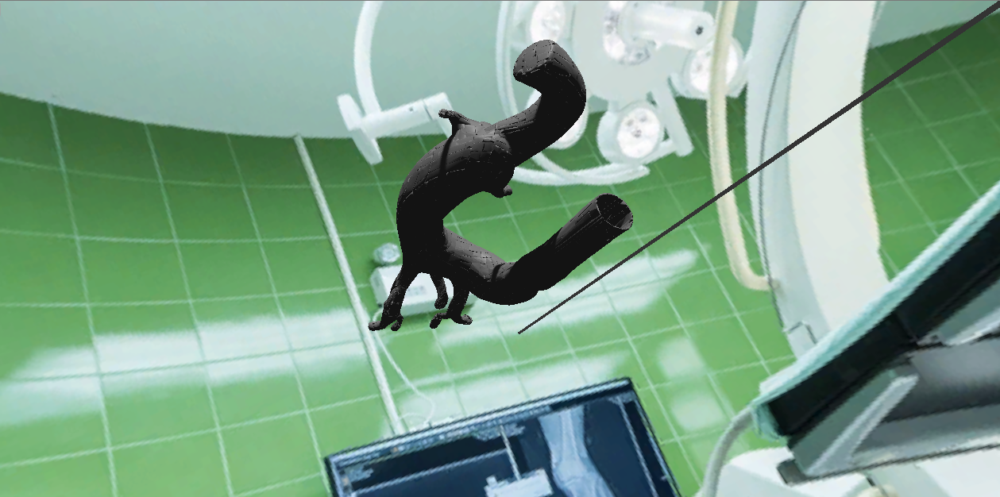
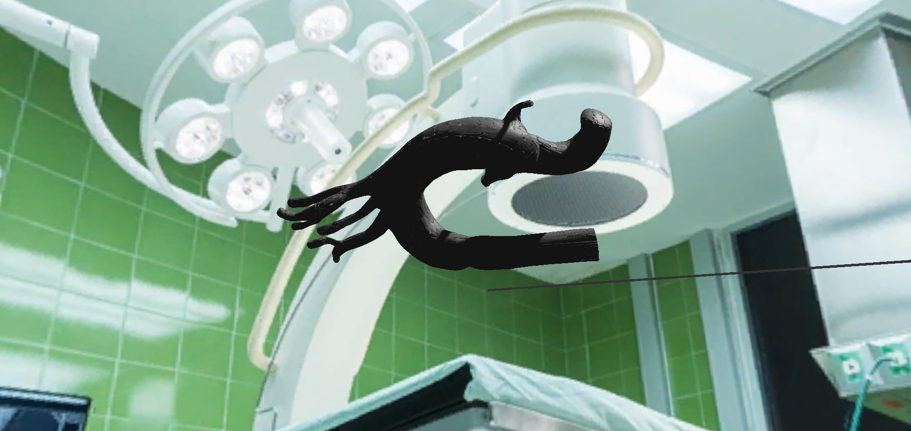

# CathSim: An Open-source Simulator for Endovascular Intervention
### [[Project Page](https://RobotVisionAI.github.io/cathsim/)] [[Paper](https://arxiv.org/abs/2208.01455)]

## Contents
1. [Requirements](#requirements)
2. [Installation](#installation)

## Requirements
1. Unity Hub

## Installation

1. Install the Unity Hub
2. Import the project package "haptic-feedback" into Unity, then Run it

## Scripts

### 1. CatmullRomSpline.cs
The "CatmullRomSpline" script provides a Catmull-Rom spline interpolation implementation for creating smooth curves between control points

How to Use:

1. Attach the CatmullRomSpline script to an empty GameObject or any GameObject where you need spline interpolation.
2. Create an array of control points (values) that you want to interpolate.
3. Initialize the CatmullRomSpline by calling the constructor with the control points array.
4. Use the GetValue method to interpolate values along the spline at different positions.
   
   
### 2. MouseDraggable.cs
The MouseDraggable script allows you to click and drag a GameObject with a Rigidbody attached to it, making it follow the mouse cursor's movement, within the Unity game engine. It smoothly moves the object in response to mouse input, temporarily disabling physics simulation for smooth dragging.

How to Use:

1. Attach the MouseDraggable script to the GameObject you want to make draggable. Make sure the GameObject has a Rigidbody component attached.
2. In the Unity Inspector, you will see the MouseDraggable script component. Customize the parameter for Drag Sensitivity. Adjust the drag sensitivity to control how responsive the object is to mouse movement.
3. Play the Unity scene to test the draggable behavior.
4. When you click on the GameObject, it will become draggable by the mouse. You can click and drag it to move it around.
5. Release the mouse button to stop dragging. The GameObject will then resume its normal physics behavior.
   

### 3. RopeController.cs
This script manages a dynamic rope made of interconnected fragments, handles length adjustment, collisions, and provides haptic feedback.

Features: 
- Dynamic rope with adjustable length
- Collision detection with objects in the environment
- Haptic feedback support for VR and non-VR platforms

How to Use:

1. Requirements:
   Ensure that you have Unity installed and a compatible version of the Unity XR Plugin if you plan to use VR features.
2. Setup:
   Attach this script to the GameObject in your scene.
   Create a prefab for rope fragments and assign it to the fragmentPrefab field.
   Configure the desired number of fragments, spacing between them, and raycast distance
   for collisions in the inspector.
3. Haptic Feedback (VR):
   If you're using VR, make sure you have the XR settings configured in your Unity
   project. The script automatically checks for VR support.
4. Layer Configuration:
   Create a layer named "Environment" in your Unity project.
   Assign this layer to the objects in your scene that the rope should collide with.
5. Usage:
   Play the scene.
   Use the Vertical axis input (e.g., arrow keys or joystick) to adjust the rope's length.
   The rope will interact with objects in the "Environment" layer and trigger haptic
   feedback when a collision occurs.
6. Collision Handling:
   To customize the response to rope fragment collisions, you can modify the 
   OnCollisionEnter method in this script

### 4. HapticFeedbackManager.cs
This Unity script provides a simple way to trigger haptic feedback on supported platforms, including mobile devices and VR headsets.

Features:
- Supports haptic feedback on platforms that allow vibration
- Compatible with VR platforms, providing haptic feedback for left and right hand controllers (if supported)
- Easily customizable duration and intensity of the haptic feedback

How to Use:
1. Attach the HapticFeedbackManager script to a GameObject in your Unity scene.
2. Customize the haptic feedback duration and intensity by adjusting the hapticDuration and hapticIntensity variables in the Inspector.
3. Call the TriggerHapticFeedback method from your script or UI button click event to trigger haptic feedback.

   
## Demo

## License
Please feel free to copy, distribute, display, perform or remix our work but for non-commercial porposes only.
