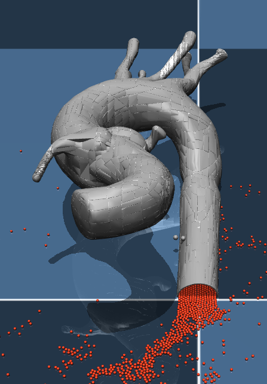

# CathSim: An Open-source Simulator for Endovascular Intervention
### [[Project Page](https://RobotVisionAI.github.io/cathsim/)] [[Paper](https://arxiv.org/abs/2208.01455)]


## Contents
1. [Requirements](#requirements)
2. [Installation](#installation)
3. [Quickstart](#quickstart)


## Requirements
1. Ubuntu based system
2. Conda


## Installation

1. Create a `conda environment`:

```bash
conda create -n cathsim python=3.9
conda activate cathsim
```

2. Install the environment:

```bash
git clone git@github.com:robotvision-ai/cathsim
cd cathsim
pip install -e .
```

## Quickstart

A quick way to run the simulation blood within the cathsim environment.

```python
from cathsim.cathsim.env import run_env_with_blood

run_env_with_blood()


```


In order to test only the blood in Aorta on Mujuco models available run:
```bash
python ./scripts/run_fluid.py 
```



## Contributors
- [Tudor Jianu](https://tudorjnu.github.io/)
- [Baoru Huang](https://baoru.netlify.app)
- Jingxuan Kang
- Tuan Van Vo
- [Mohamed E. M. K. Abdelaziz](https://memkabdelaziz.com/)
- [Minh Nhat Vu](https://www.acin.tuwien.ac.at/staff/mnv/)
- [Sebastiano Fichera](https://www.liverpool.ac.uk/engineering/staff/sebastiano-fichera/)
- [Chun-Yi Lee](https://elsalab.ai/about)
- [Olatunji Mumini Omisore](https://sites.google.com/view/moom1)
- [Pierre Berthet-Rayne](https://caranx-medical.com/pierre-berthet-rayne-phd-ing/)
- [Ferdinando Rodriguez y Baena](https://www.imperial.ac.uk/people/f.rodriguez)
- [Anh Nguyen](https://cgi.csc.liv.ac.uk/~anguyen/)


## License
Please feel free to copy, distribute, display, perform or remix our work but for non-commercial porposes only.
